<div align="center">

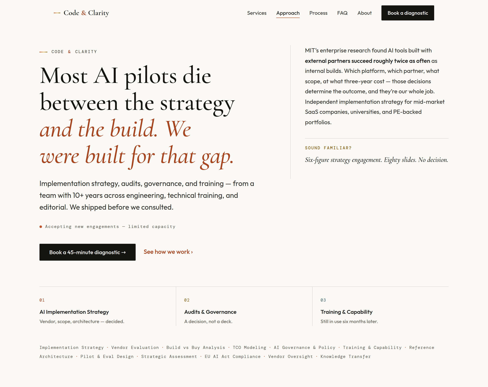

<br/>

# Code&nbsp;&&nbsp;Clarity

### An independent AI advisory, built as a quiet publication.

The marketing site for a boutique AI advisory practice — **implementation strategy, audits & governance, and training** — designed and built as a warm-light editorial system where *clarity is the literal product*.

<br/>


</div>

---

## What this is

A single-page React site for **codeclarity.ai**. The brief was unusual: the founder is an engineer, educator, and editor repositioning as an *independent* AI advisor — someone who tells you what to build, who should build it, and what it should cost, but **doesn't take the build**. The design had to signal senior judgment and editorial craft to a skeptical audience (mid-market SaaS CTOs, university CIOs, PE operating partners) **without** wearing the default costume of AI products: no purple gradients, no particle fields, no glassmorphism, no robot imagery.

The answer is **"The Quiet Publication"** — a warm ivory, serif-led, print-inspired system in the lineage of Anthropic's research journal, Stripe Press, and Ink & Switch. Every editorial device does a job; every animation explains something; the only numbers on the page are externally sourced research or contractual facts.

<div align="center">
<br/>
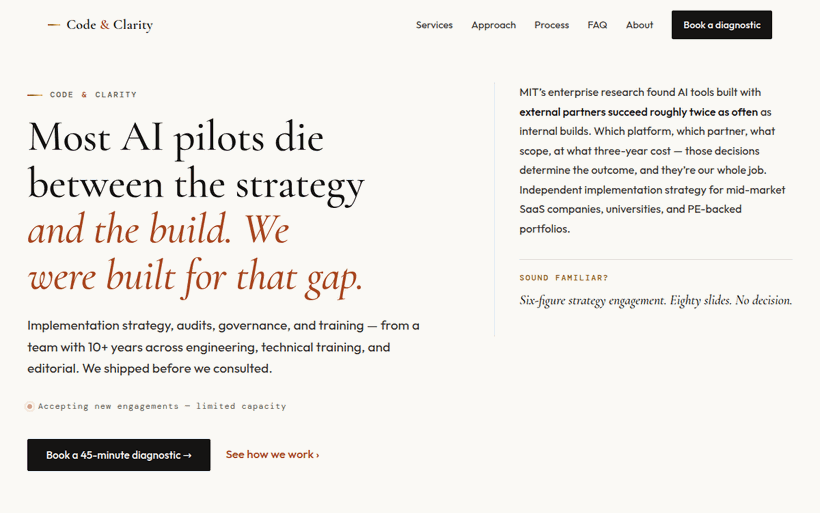
<br/>
<em>The full page, top to bottom.</em>
</div>

---

## The signature moment: diagrams that teach

The homepage doesn't decorate — it *explains*. Two inline-SVG diagrams draw themselves on scroll and run a continuous, restrained flow that traces the actual argument. Both are fully legible as static images, keyboard-operable, and collapse to a still frame under `prefers-reduced-motion`.

<table>
<tr>
<td width="50%" valign="top" align="center">
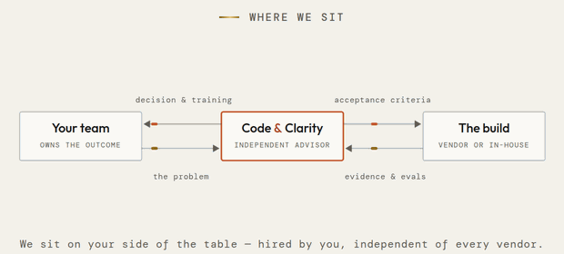
<br/>
<strong>Where we sit</strong><br/>
<em>The advisory model: hired by you, independent of the builder. Problem in, decision &amp; training back, acceptance criteria out, evidence returning.</em>
</td>
<td width="50%" valign="top" align="center">
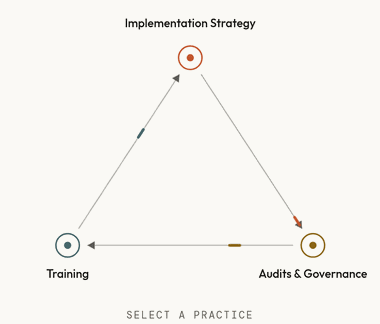
<br/>
<strong>The practice loop</strong><br/>
<em>Implementation strategy → audits &amp; governance → training, each feeding the next. Click any node to spotlight its practice.</em>
</td>
</tr>
</table>

---

## A tour, in sections

<table>
<tr>
<td width="50%" valign="top">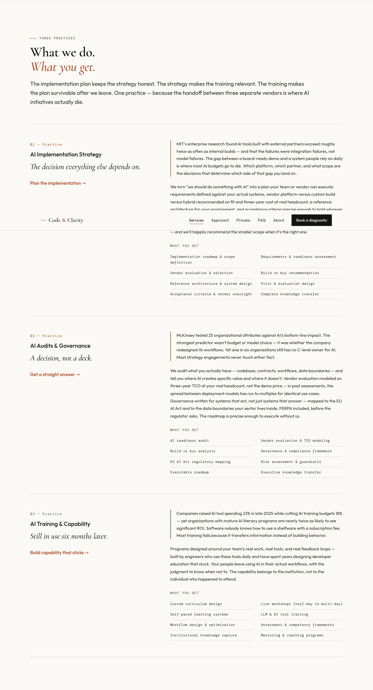<br/><sub><strong>Services</strong> — each practice as an editorial "chapter" with an insight, method, and deliverables.</sub></td>
<td width="50%" valign="top">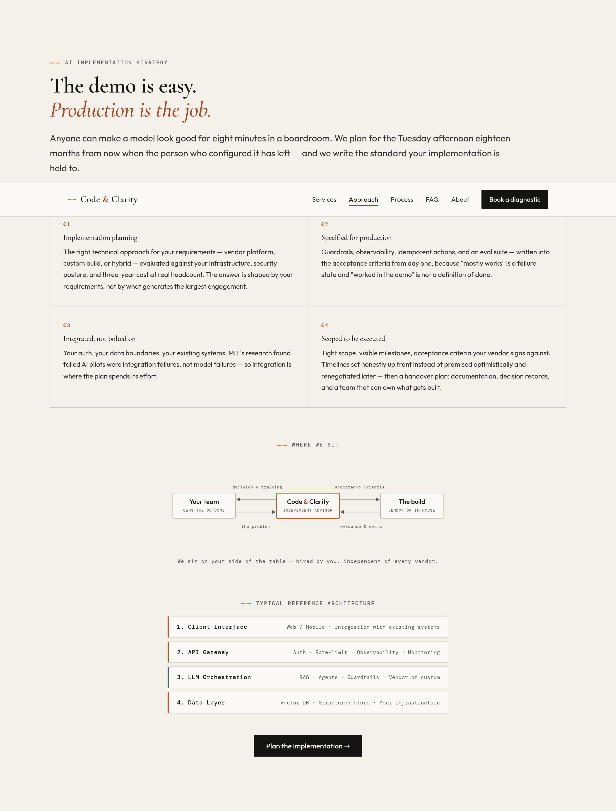<br/><sub><strong>Approach</strong> — the implementation-strategy deep dive, the engagement diagram, and a reference architecture.</sub></td>
</tr>
<tr>
<td width="50%" valign="top">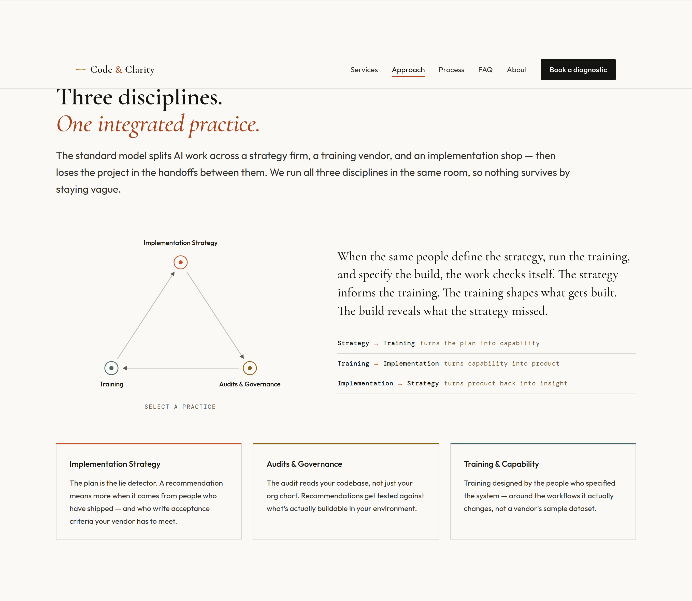<br/><sub><strong>Why one practice</strong> — the self-explaining loop and its three spotlightable cards.</sub></td>
<td width="50%" valign="top">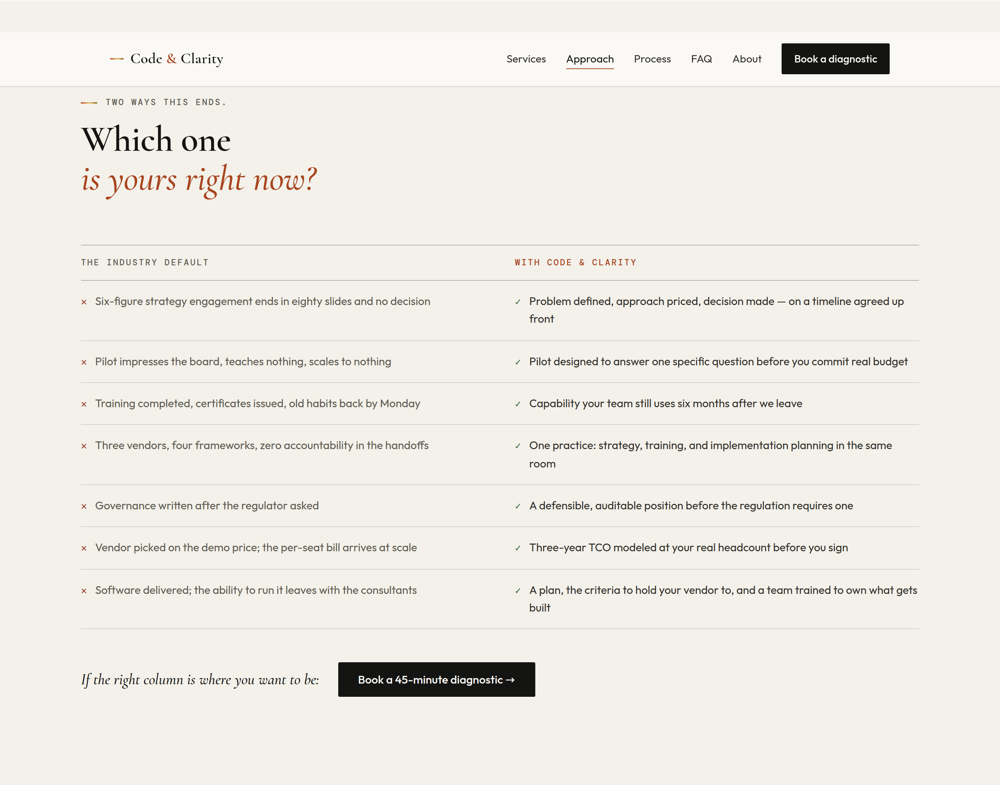<br/><sub><strong>Two ways this ends</strong> — a ✕ / ✓ ledger contrasting the industry default with the practice.</sub></td>
</tr>
<tr>
<td width="50%" valign="top">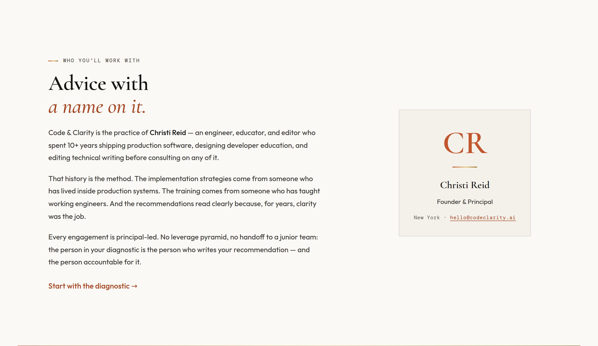<br/><sub><strong>About</strong> — advice with a name on it: the principal, with a typographic monogram card.</sub></td>
<td width="50%" valign="top">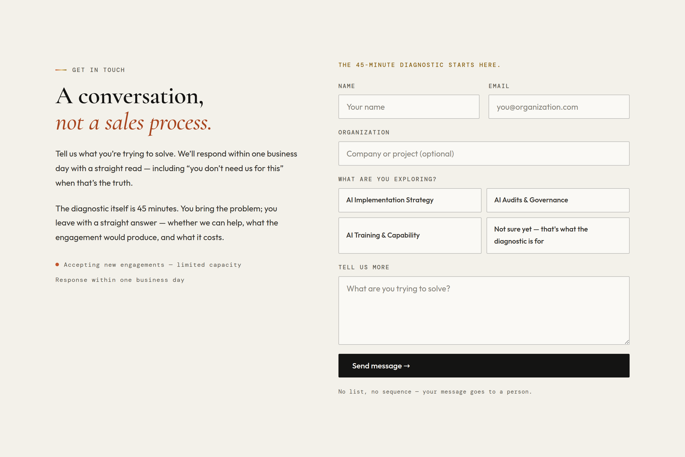<br/><sub><strong>Contact</strong> — the diagnostic form, with honeypot spam protection and a working Resend pipeline.</sub></td>
</tr>
</table>

<div align="center">
<br/>
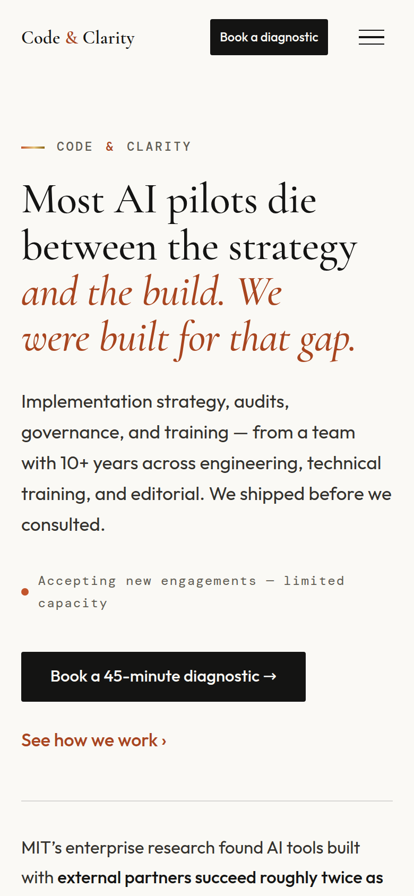
<br/>
<em>Phone-first: audited for zero overflow and 24px+ tap targets from 320px up, with a persistent nav CTA.</em>
</div>

---

## The design system

**"The Quiet Publication"** — warm-light editorial. The full token set, decision log, and rationale live in [`DESIGN_DECISIONS.md`](./DESIGN_DECISIONS.md).

#### Palette — warm ivory, warm ink, one earthy accent held in reserve


The retired old design's near-black "void" palette, cyan accent, and five animated canvases are gone. The prism gradient (`terracotta → gold`) is the one decorative element — rationed to thin rules, the logo, and dividers, and it's the only thing that carries continuous motion.

#### Typography — a self-hosted editorial triad

| Face | Role |
|---|---|
| **Cormorant Garamond** | Display only — headlines, the italic terracotta "turns," pull quotes |
| **Outfit** | Body & UI |
| **DM Mono** | Kickers, labels, metadata, folios, the archival-index strips |

All fonts are self-hosted as latin-subset `woff2`, preloaded, with metric-compatible fallbacks so **CLS is 0**.

#### Motion — pedagogy, not decoration

Every animation explains, reveals structure, or guides reading. Three continuous, on-brand loops (light flowing through the prism rules, the availability dot breathing, pulses tracing the flow diagrams) are **pure CSS, compositor-only**, and every one collapses to a static final state under reduced motion. `framer-motion` was removed entirely — entrances are `IntersectionObserver` + CSS.

---

## Under the hood

- **Stack** — React 19 · Vite · TypeScript (strict), a small client-side path router, no CSS framework
- **Contact API** — a Vercel serverless function (`api/send-email.ts`) delivering via Resend, with a honeypot
- **Accessibility** — WCAG 2.1 AA verified with per-token contrast math; full keyboard nav; skip link; semantic landmarks; native `<details>` FAQ; `/accessibility` statement page
- **Performance** — Lighthouse mobile **97 / 100 / 100 / 100**, LCP ~2.4s, CLS 0, no runtime animation library
- **SEO** — `ProfessionalService` JSON-LD, `sitemap.xml`, Open Graph card, `robots.txt`
- **Verified from the terminal** — `scripts/` holds the Playwright visual-QA, mobile-audit, and asset-render tooling used throughout (the GIFs above were rendered by it)

```
src/
  components/     Nav, Hero, ManifestoBreak, Services, ProductSignal,
                  TransformZones (the loop), ContrastBreak, Process, FAQ, About, Contact, Footer
  pages/          Accessibility, Privacy, Specimen (/dev type specimen)
  styles/         globals.css — the whole token system + editorial primitives
  client.tsx      entry + tiny router   ·   App.tsx  page composition
api/              send-email.ts (Resend + honeypot)
public/fonts/     self-hosted woff2 (Cormorant · Outfit · DM Mono)
docs/assets/      the media in this README
scripts/          Playwright QA · mobile audit · brand-asset & GIF rendering
```

#### Project docs

| File | What it is |
|---|---|
| [`AUDIT.md`](./AUDIT.md) | Phase-0 inventory of the original codebase and its disposition |
| [`DESIGN_DECISIONS.md`](./DESIGN_DECISIONS.md) | The single source of truth: tokens, type, motion, every decision |
| [`QA_REPORT.md`](./QA_REPORT.md) | Visual pass, accessibility math, performance numbers, AI-tell audit |
| [`FINAL_REPORT.md`](./FINAL_REPORT.md) | What shipped per phase, every deviation, open items |
| [`LINKEDIN_COPY.md`](./LINKEDIN_COPY.md) · [`LINKEDIN_FOUNDER_PROFILE.md`](./LINKEDIN_FOUNDER_PROFILE.md) | Matching LinkedIn company-page & founder-profile kits |

---

## Running locally

```bash
npm install
npm run dev        # http://localhost:5173
npm run build      # production build → dist/
```

The contact form's email send needs Vercel + a `RESEND_API_KEY` env var; everything else runs locally. Deployment is Vercel (the repo root is the Vite app; `api/` are serverless functions).

<div align="center">
<br/>
<sub>Design &amp; build by <strong>Christi Reid</strong> · <a href="https://codeclarity.ai">codeclarity.ai</a></sub>
</div>
